# Octabyte DevOps Assignment

End-to-end infrastructure, CI/CD, and monitoring for a small Node.js todo app on AWS.
Everything is provisioned with Terraform, deployed through a Jenkins pipeline, and
monitored with a self-hosted Prometheus/Grafana/Loki stack.

The application itself is a readymade Express todo app (task logic is not the point of
this assignment); it was extended to persist tasks in PostgreSQL and expose a `/health`
endpoint so the load balancer and monitoring have something real to check.

## Notes for reviewers

1. **AI assistance** — AI was used as a pair-programming assistant, mainly for debugging and
   for writing/refining this documentation. All architecture decisions and tradeoffs are my
   own, and I'm happy to walk through any part of the implementation live.
2. **Cost-conscious by design** — the environment was built to minimize personal AWS cost
   (NAT gateway disabled, a single small instance running both staging and production
   containers, `db.t4g.micro` RDS, and `terraform destroy` between sessions). Some choices
   therefore favor cost over production-grade isolation; those tradeoffs are called out in
   the Architecture Decisions section and in `APPROACH.md`.

## Architecture

```
                         Internet
                            │
                     ┌──────┴───────┐
                     │     ALB      │  host-based routing
                     └──────┬───────┘
              staging.* ────┤        └──── default (prod)
                            │
                   ┌────────┴─────────┐
                   │    App EC2       │   Docker:
                   │  :8081 staging   │   - myapp-staging
                   │  :8080 prod      │   - myapp-production
                   │  node_exporter   │   - node_exporter / cAdvisor / promtail
                   └────────┬─────────┘
                            │ (private)
                   ┌────────┴─────────┐        ┌────────────────────┐
                   │  RDS PostgreSQL  │        │  Monitoring EC2     │
                   │  appdb_staging   │◀──────▶│  Prometheus/Grafana │
                   │  appdb_prod      │ scrape │  Loki / pg_exporter │
                   └──────────────────┘        └────────────────────┘

Jenkins (separate EC2) ── build/scan/push to ECR ── deploy via SSM ──▶ App EC2
```

- **VPC**: 2 public + 2 private subnets across two AZs.
- **App EC2** (public): runs staging and prod containers plus the metric exporters.
- **RDS PostgreSQL** (private): one instance, a separate database per environment.
- **ALB**: host-based routing — `staging.*` to the staging target group, everything else to prod.
- **Monitoring EC2** (public, locked to my IP): Prometheus, Grafana, Loki, postgres_exporter.
- **ECR**: private registry for the app image.
- Remote Terraform state in **S3** with **DynamoDB** locking.

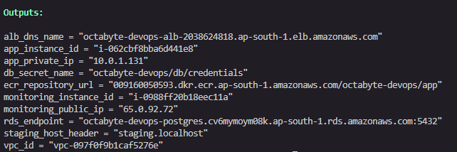

## Architecture decisions

### 1. Staging and production on one EC2, separated by port

Staging and production run as **two containers on the same app instance**, on different
host ports (8081 and 8080), from the **same image**, with separate env files and separate
databases (`appdb_staging`, `appdb_prod`) on the shared RDS instance. The ALB routes to
each via host-based rules.

This is a deliberate cost-vs-isolation tradeoff for the assessment: one instance instead
of two, so no duplicated compute. The downside is shared blast radius — a misbehaving
staging container shares CPU/memory with prod. The deploy logic is environment-parameterized
(the same script deploys both, only the target/env differs), so moving production onto its
own instance later is essentially a one-line change rather than a rewrite. In a real
production setup I would separate them (different instances, ideally different accounts).

### 2. SSM instead of SSH for all instance access

No instance exposes port 22. Jenkins deploys with `aws ssm send-command`, and I connect
for maintenance via SSM Session Manager. Access is IAM-scoped, there are no SSH keys to
manage, and the attack surface is smaller.

### 3. Single NAT / NAT disabled

The only resource in the private subnets is RDS, which needs no outbound internet. NAT is
therefore disabled, saving ~$32/month with no loss of function.

### 4. Self-hosted, open-source monitoring

Prometheus + Grafana + Loki rather than CloudWatch/Datadog — no licensing cost and it
satisfies the infra/app/DB metrics and centralized-logging requirements on one small box.

### 5. Jenkins on its own instance with an IAM role

Jenkins runs on a separate EC2 with an instance role granting ECR push + SSM. No AWS keys
are stored in Jenkins; the account id and ECR registry are resolved at runtime via STS.

## Repository layout

```
terraform/            infrastructure (modules: vpc, security, database, compute, alb, ecr)
  bootstrap/          one-time S3 + DynamoDB backend
node-js-dummy-test/   the app (Express + pg, tests, Dockerfile)
ci/                   Jenkinsfile + SSM deploy scripts
deploy/               per-env compose files, deploy/smoke scripts, promtail
monitoring/           Prometheus/Grafana/Loki compose + dashboards
docs/images/          screenshots
```

## Setup

### Prerequisites
- Terraform >= 1.5, AWS CLI configured for `ap-south-1`
- An AWS account (admin credentials used for provisioning during the assessment)
- Docker (for local builds), the SSM Session Manager plugin (for instance access)

### 1. Bootstrap remote state (once)
```bash
cd terraform/bootstrap
terraform init && terraform apply
```
Copy the bucket name into `terraform/backend.tf`.

### 2. Provision the infrastructure
```bash
cd terraform
cp terraform.tfvars.example terraform.tfvars   # set admin_cidr to your IP/32
terraform init
terraform apply
```

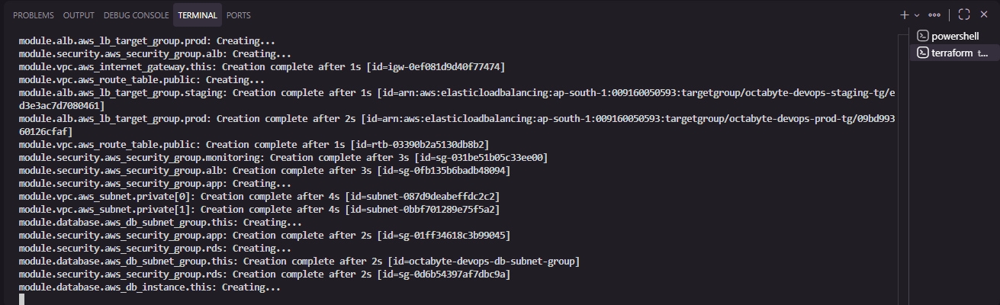

Key outputs: `alb_dns_name`, `app_instance_id`, `monitoring_public_ip`, `rds_endpoint`.

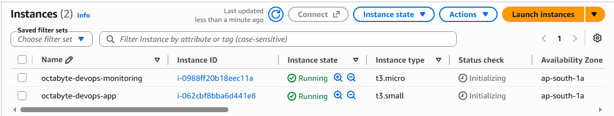

### 3. Configure Jenkins
- Set global env `APP_INSTANCE_ID` = `terraform output app_instance_id`.
- Multibranch pipeline pointing at this repo, script path `ci/Jenkinsfile`.
- SMTP configured under Manage Jenkins → System for failure emails.

### 4. Run the pipeline
Test → dependency scan → build → image scan → push to ECR → deploy staging →
manual approval → deploy production.

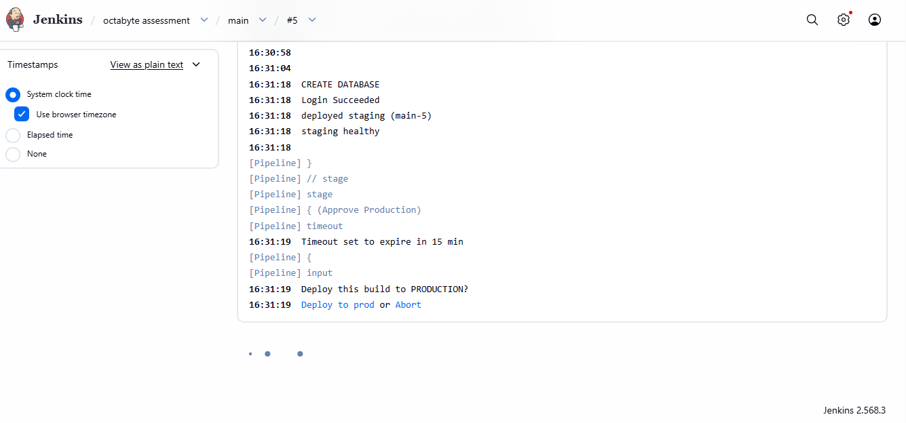
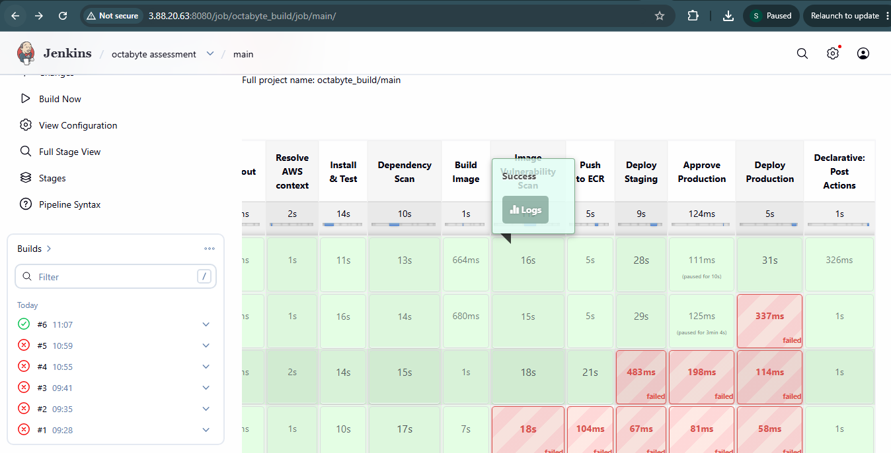

### 5. Verify the app
```bash
curl http://<alb_dns_name>/health                     # prod
curl -H "Host: staging.localhost" http://<alb_dns_name>/health   # staging
```

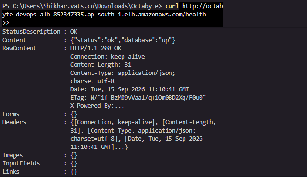

### 6. Deploy monitoring (manual, via SSM)
The app is deployed by Jenkins, but the monitoring stack is a one-time manual setup:
connect to the monitoring instance with SSM Session Manager (no SSH), pull the config
from the artifacts S3 bucket, and `docker compose up`. Full steps in
[`monitoring/README.md`](monitoring/README.md). Grafana runs on
`http://<monitoring_public_ip>:3000`, restricted to `admin_cidr`.

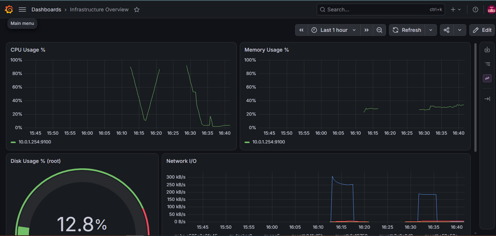
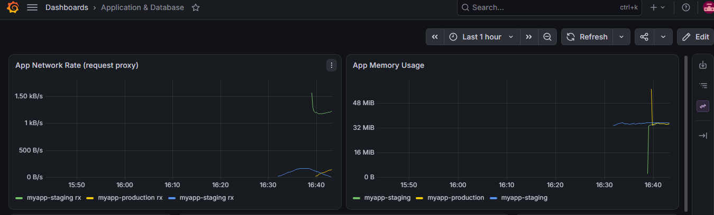

## Load balancer routing

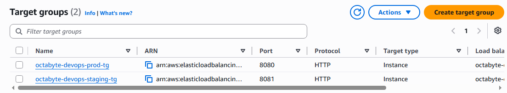
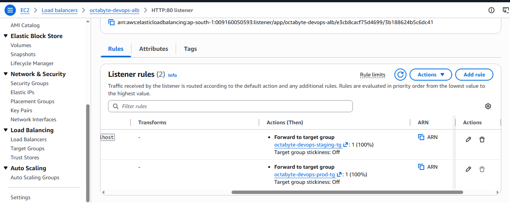

## Security considerations

- **No public SSH** — access is via SSM Session Manager only; port 22 is closed everywhere.
- **RDS is private** — no public access; reachable only from the app and monitoring security groups.
- **Least-privilege-ish IAM** — the EC2 role can read the one DB secret and its SSM param path, pull from ECR, and use SSM. Terraform itself was run with admin for speed during the assessment; in production I would scope it to the specific services used.
- **Encryption** — EBS volumes, RDS storage, and the state bucket are all encrypted; IMDSv2 is enforced on the instances.
- **Monitoring dashboards** are restricted to my IP via `admin_cidr`, not open to the internet.
- **Secrets** are generated by Terraform and stored in Secrets Manager, never in the repo.

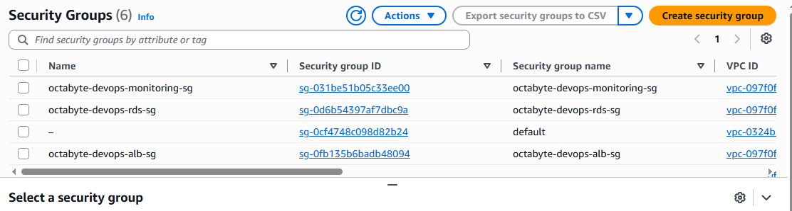

## Cost optimization

- **NAT gateway disabled** (~$32/mo saved) — nothing in the private subnets needs egress.
- **Single small app instance** running both environments instead of two instances.
- **db.t4g.micro**, single-AZ RDS — cheapest workable Postgres.
- **ECR lifecycle policy** expires untagged images and caps tagged ones so storage stays tiny.
- **`terraform destroy` between sessions** — the environment is torn down when not in use, keeping actual cost for the assessment to a few dollars.

## Secret management & backup

Both of the optional best practices are implemented:

- **Secret management**: the RDS password is generated with `random_password` and stored in
  AWS Secrets Manager (`octabyte-devops/db/credentials`). The app and deploy script read it
  at deploy time; it is never committed.
- **Backup strategy**: RDS automated daily backups with 7-day retention. (The final-snapshot-
  on-destroy is disabled for this short-lived assessment environment to keep teardown clean;
  in production it would be enabled.)

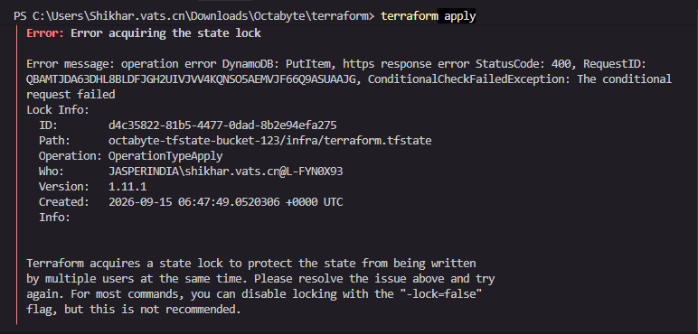

## Notifications

The pipeline emails on failure (Manage Jenkins SMTP + the `post { failure }` block).

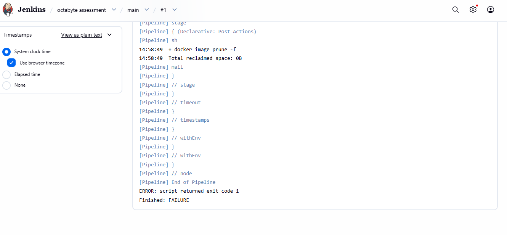
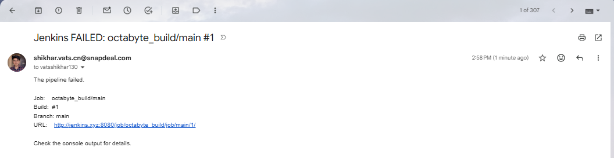

## Further reading

- [`APPROACH.md`](APPROACH.md) — how each part was approached and why.
- [`CHALLENGES.md`](CHALLENGES.md) — problems hit during the assignment and how they were resolved.
- [`ci/README.md`](ci/README.md) — Jenkins setup details.
- [`monitoring/README.md`](monitoring/README.md) — monitoring deploy + requirement mapping.
